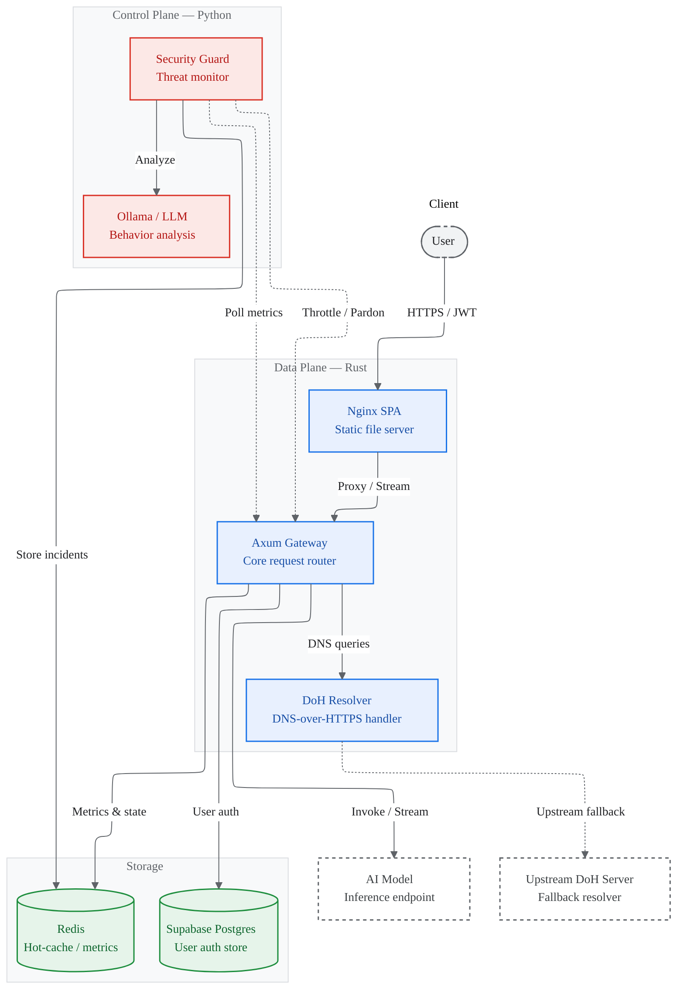

# Fluxgate

**Enterprise AI API Gateway**

A high-performance, secure, and observable gateway for production AI deployments — built on a dual-plane architecture that separates high-speed proxying from intelligent security enforcement.

[](./LICENSE)
[](https://www.rust-lang.org/)
[](https://www.python.org/)
[](https://www.docker.com/)

---

## Overview

Fluxgate bridges the gap between raw AI model deployment and enterprise-grade security requirements. By decoupling a high-speed **Data Plane** (Rust) from an intelligent **Control Plane** (Python/MCP), it provides granular rate limiting, persistent incident auditing, and real-time observability — without sacrificing throughput.

---

## Architecture

Fluxgate follows a **dual-plane architecture**:

- **Data Plane (Rust/Axum):** Handles all high-frequency HTTP traffic, streaming responses, TLS termination, authentication, and DNS resolution via a built-in DoH resolver. Offloads monitoring metrics to Redis.
- **Control Plane (Python/FastMCP):** An out-of-band security agent that monitors gateway metrics, executes adaptive throttling (the "penalty box"), and generates human-readable incident reports using a local LLM.



---

## Features

**Secure Authentication**
Industry-standard Argon2 password hashing combined with HttpOnly JWT session management, protecting against XSS and session hijacking.

**High-Speed Streaming**
Rust's `tokio` runtime and native async streaming proxy AI responses chunk-by-chunk, minimizing memory overhead and latency at scale.

**Algorithmic Guard**
An out-of-band Python agent detects Context Flooding and unauthorized token consumption, automatically moving offenders to a penalty-box rate limit with zero impact on the hot path.

**MCP-Compliant Observability**
The Control Plane exposes a Model Context Protocol (MCP) interface, allowing external AI assistants to query real-time gateway metrics and audit security logs.

**Built-in DNS-over-HTTPS (DoH)**
The Data Plane includes a custom DoH resolver with local override support and upstream fallback, keeping all DNS resolution encrypted and entirely within the gateway process — no system resolver dependency.

**Persistent Incident Auditing**
A Redis-backed circular buffer maintains an immutable log of security anomalies, surviving system reboots and service restarts.

---

## Tech Stack

| Component | Technology | Role |
|---|---|---|
| **Data Plane** | Rust, Axum, SQLx | High-performance proxying, authentication & DoH |
| **Control Plane** | Python, FastMCP | Security logic & LLM orchestration |
| **Persistence** | Redis, Supabase (Postgres) | Caching, session state, incident logs |
| **Frontend** | Nginx, Vanilla JS, Tailwind CSS | Single Page Application (SPA) |
| **Containerization** | Docker, Docker Compose | Service orchestration |

---

## Prerequisites

- [Docker](https://docs.docker.com/get-docker/) & [Docker Compose](https://docs.docker.com/compose/)
- [Ollama](https://ollama.com/) — for the local AI model
- [Supabase](https://supabase.com/) account — for database persistence

---

## Getting Started

### 1. Clone the Repository

```bash
git clone https://github.com/your-username/fluxgate.git
cd fluxgate
```

### 2. Configure Environment

Copy the example environment file and fill in your values:

```bash
cp .env.example .env
```

| Variable | Description |
|---|---|
| `DATABASE_URL` | Supabase Connection Pooler URL (IPv4-compatible) |
| `REDIS_URL` | Redis connection string |
| `JWT_SECRET` | HMAC secret for JWT signing and verification (min. 256-bit) |
| `DOWNSTREAM_AI_URLS` | URL to your local AI model (e.g., `http://host.docker.internal:11434`) |

### 3. Bootstrap the Database

Run `init.sql` on your Supabase instance to create the required `users` and `api_keys` tables before starting the cluster.

### 4. Start the Cluster

```bash
docker-compose up -d --build
```

### 5. Access the Services

| Service | Address |
|---|---|
| Frontend | `http://localhost:3000` |
| Data Plane | `https://localhost:8443` |
| Control Plane (MCP) | `http://localhost:8000` |

---

## Repository Structure

```
fluxgate/
├── gateway/          # Data Plane — Rust/Axum gateway, DoH resolver, auth
├── control-plane/    # Control Plane — Python security guard & LLM orchestration
├── frontend/         # Nginx SPA static file server
├── init.sql          # Supabase schema bootstrap
└── docker-compose.yml
```

For implementation detail, request flow diagrams, configuration references, and development guides, see the service-level READMEs:

| Service | README |
|---|---|
| Data Plane (gateway, DoH, auth, admin API) | [`gateway/README.md`](./gateway/README.md) |
| Control Plane (security guard, LLM, MCP) | [`control-plane/README.md`](./control-plane/README.md) |
| Frontend (SPA, Nginx) | [`frontend/README.md`](./frontend/README.md) |

---

## License

This project is licensed under the [MIT License](./LICENSE).

---

<div align="center">
  <sub>Built for performance. Designed for security.</sub>
</div>