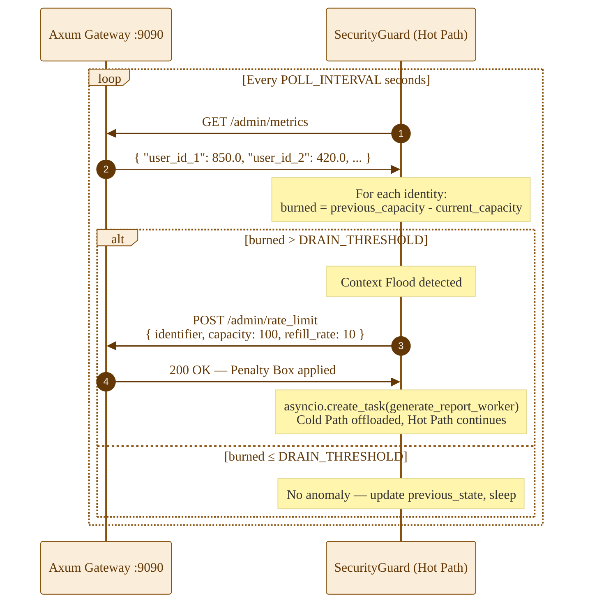
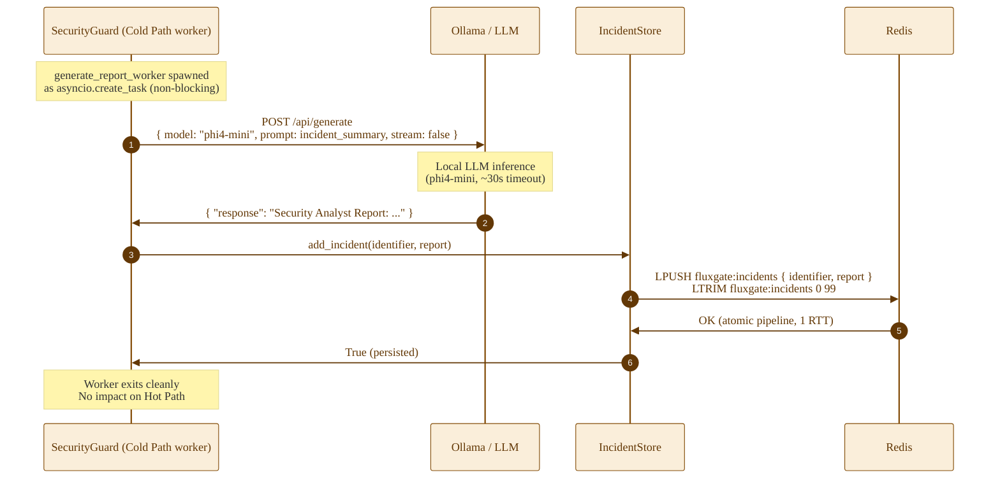
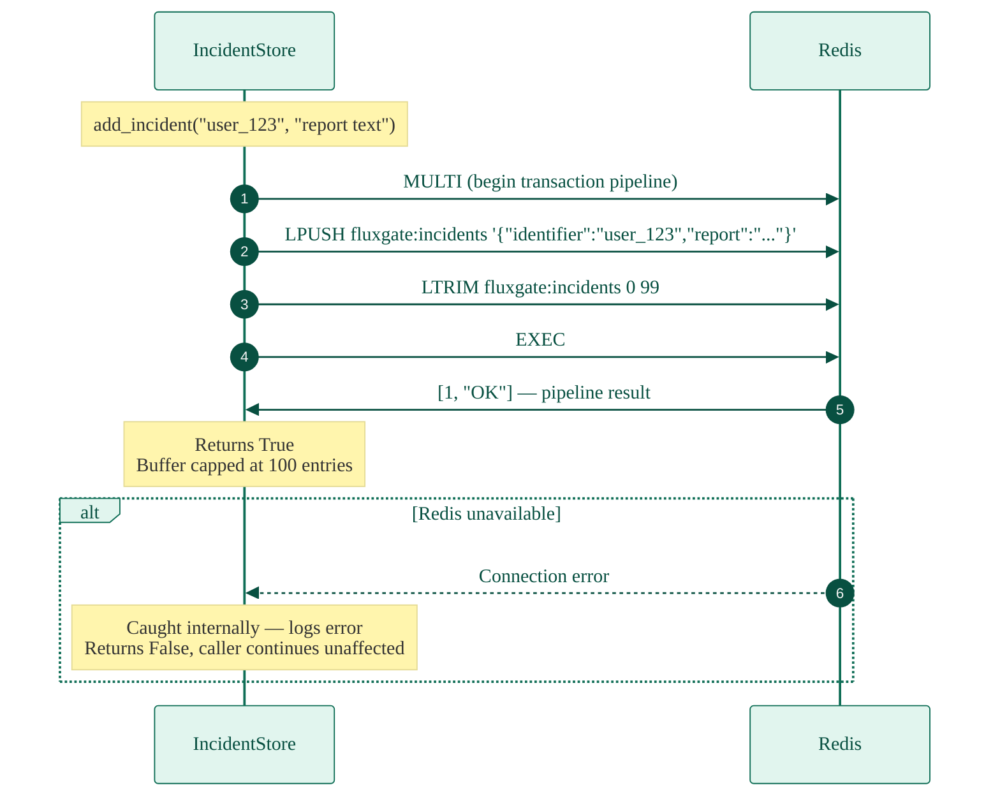
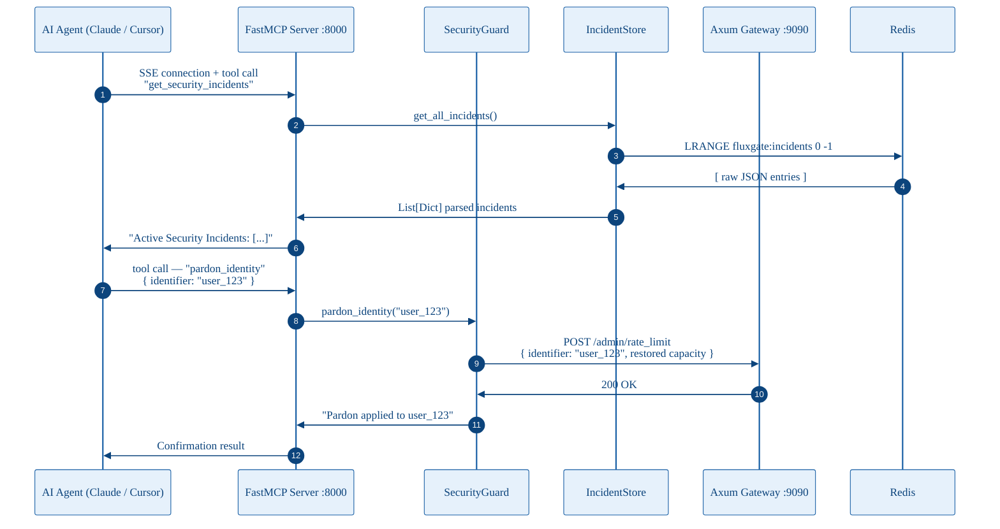

# Fluxgate Control Plane — MCP SOC Agent (`control-plane/`)

> Autonomous Security Operations Center built in Python. Monitors the Data Plane in real time, escalates anomalies to a local LLM, and exposes a Model Context Protocol server for AI-native operator tooling.

[](https://www.python.org/)
[](https://github.com/jlowin/fastmcp)
[](../../LICENSE)

---

## Table of Contents

- [Overview](#overview)
- [Architecture Position](#architecture-position)
- [Core Responsibilities](#core-responsibilities)
- [Technical Stack](#technical-stack)
- [Module Structure](#module-structure)
- [Environment Configuration](#environment-configuration)
- [Dataflow Sequences](#dataflow-sequences)
  - [1. Hot Path — Algorithmic Threat Detection](#1-hot-path--algorithmic-threat-detection)
  - [2. Cold Path — LLM Incident Analysis](#2-cold-path--llm-incident-analysis)
  - [3. Incident Persistence — Redis Circular Buffer](#3-incident-persistence--redis-circular-buffer)
  - [4. MCP Tool Invocation — AI Agent Queries](#4-mcp-tool-invocation--ai-agent-queries)
- [MCP Tool Reference](#mcp-tool-reference)
- [Security Model](#security-model)
- [Algorithmic Guard — How It Works](#algorithmic-guard--how-it-works)
- [Development](#development)
- [Operational Notes](#operational-notes)
- [Related Services](#related-services)

---

## Overview

The `control-plane/` service is the **brain** of the Fluxgate ecosystem. It runs entirely out-of-band from the hot request path, meaning its LLM inference calls, Redis writes, and HTTP polling never add latency to client-facing AI responses.

Its two execution modes — the **Hot Path** (microsecond threshold checks) and the **Cold Path** (async LLM analysis) — are decoupled by design. A threat is neutralized by the Hot Path the instant it is detected. The Cold Path then offloads a full incident report to Ollama in the background with no blocking consequences.

The service also exposes a **Model Context Protocol (MCP)** server on port `8000`, making its live metrics, incident logs, and administrative actions natively accessible to AI assistants such as Claude, Cursor, or Continue.dev — enabling a human operator to query and manage the security posture through natural language.

```
[Axum Gateway :9090] ←── polls metrics ──── [SecurityGuard Hot Path]
        ↓ throttle                                     ↓ (threshold breach)
[Penalty Box applied]          [generate_report_worker — Cold Path]
                                           ↓
                                    [Ollama LLM inference]
                                           ↓
                               [IncidentStore → Redis LPUSH]
                                           ↑
                          [MCP Tools — Claude / AI Agent queries]
```

---

## Architecture Position

The Control Plane has no shared code with the Data Plane. It communicates exclusively over HTTP: polling the gateway's admin metrics endpoint and issuing throttle/pardon commands. This strict separation means the Control Plane can be restarted, upgraded, or fail entirely without impacting real-time API traffic.

| Tier              | Service                         | Language | Role                                |
| ----------------- | ------------------------------- | -------- | ----------------------------------- |
| **Data Plane**    | `gateway/`                      | Rust     | TLS, auth, proxy, metrics export    |
| **Data Plane**    | `nginx/`                        | Nginx    | SPA static serving                  |
| **Data Plane**    | `doh/`                          | Rust     | DNS-over-HTTPS resolution           |
| **Control Plane** | `control-plane/` (this service) | Python   | Threat detection, LLM analysis, MCP |
| **Storage**       | Redis                           | —        | Hot-cache, metrics, incident log    |
| **Storage**       | Supabase Postgres               | —        | User auth, identity (gateway-owned) |

---

## Core Responsibilities

### Hot Path — Algorithmic Guard

A continuous `asyncio` loop polls `GET /admin/metrics` from the Rust gateway every `POLL_INTERVAL` seconds. It maintains a rolling snapshot of per-identity token bucket capacities and computes the delta between intervals. If a single identity burns more than `DRAIN_THRESHOLD` tokens in one interval ("Context Flood"), a throttle command is dispatched immediately to the gateway's Penalty Box.

This path is pure Python arithmetic — no LLM, no I/O blocking, sub-millisecond decision time.

### Cold Path — LLM Incident Analysis

Once a throttle is applied, a fire-and-forget `asyncio.create_task` offloads the incident to `generate_report_worker`. This worker submits a structured prompt to Ollama (`phi4-mini` by default), receives a human-readable security summary, and persists it to Redis. The Hot Path continues monitoring without waiting for this to complete.

### Persistent Incident Storage

Security events are stored in Redis as a **capped circular buffer** (`LPUSH` + `LTRIM`, max 100 entries). Writes are executed in a single atomic pipeline (one round-trip). This guarantees audit logs survive container restarts and that memory usage is bounded regardless of incident volume.

### Model Context Protocol (MCP) Server

A `FastMCP` server on port `8000` exposes four AI-callable tools over Server-Sent Events. Any MCP-compatible AI client can query live gateway state, retrieve incidents, pardon blocked users, or inspect internal guard diagnostics — all through natural language, with the MCP server handling the protocol translation.

---

## Technical Stack

| Component    | Library             | Version | Purpose                              |
| ------------ | ------------------- | ------- | ------------------------------------ |
| Language     | Python              | 3.11+   | Async-native, type-annotated         |
| MCP server   | FastMCP             | latest  | SSE-based Model Context Protocol     |
| HTTP server  | Uvicorn + Starlette | latest  | ASGI runtime, CORS middleware        |
| HTTP client  | HTTPX               | latest  | Async persistent connection pools    |
| Redis client | redis.asyncio       | latest  | Async Redis with pipeline support    |
| LLM backend  | Ollama (local)      | any     | Local inference, no external API key |

---

## Module Structure

```
control-plane/
├── Dockerfile
├── main.py              # Orchestrator: MCP tools, lifespan, Uvicorn entrypoint
├── requirements.txt
├── pyproject.toml
├── uv.lock
└── src/
    ├── __init__.py      # Package exports: SecurityGuard, IncidentStore, config
    ├── config.py        # Env var parsing with type-safe float coercion
    ├── guard.py         # SecurityGuard: hot path loop + cold path worker
    └── storage.py       # IncidentStore: Redis circular buffer, atomic pipeline
```

### Responsibilities by module

**`main.py`** — Application entry point. Declares the four MCP tools, manages the Uvicorn server lifecycle via `lifespan` context manager, spawns the background monitoring task, and registers a supervisor callback that catches and logs any unhandled loop crashes.

**`src/guard.py`** — The `SecurityGuard` class owns the persistent `httpx.AsyncClient` connection pool, the `run_algorithmic_loop` hot path, the `_execute_throttle` command dispatcher, and the `generate_report_worker` cold path coroutine. It is stateful: `previous_state` holds the last-seen token bucket snapshot for delta computation.

**`src/storage.py`** — The `IncidentStore` class wraps all Redis interaction. `add_incident` uses a transactional pipeline to atomically `LPUSH` and `LTRIM` in one RTT. `get_all_incidents` returns the full buffer as parsed dicts. All Redis errors are caught and logged without crashing the caller.

**`src/config.py`** — All environment variables are parsed here. Float values use `_get_float()` which silently falls back to the declared default on parse failure — preventing startup crashes from malformed env var values.

---

## Environment Configuration

All variables are optional with documented defaults. Tuning `POLL_INTERVAL`, `DRAIN_THRESHOLD`, and `PENALTY_*` is the primary lever for adjusting security sensitivity.

| Variable            | Description                                                    | Default                                          |
| :------------------ | :------------------------------------------------------------- | :----------------------------------------------- |
| `GATEWAY_ADMIN_URL` | Base URL for the Rust Data Plane admin interface               | `http://gateway:9090`                            |
| `REDIS_URL`         | Redis connection string for persistent incident logs           | `redis://redis-cache:6379`                       |
| `OLLAMA_URL`        | Ollama generation API endpoint                                 | `http://host.docker.internal:11434/api/generate` |
| `LLM_MODEL`         | Model name passed to Ollama for security reports               | `phi4-mini`                                      |
| `POLL_INTERVAL`     | Seconds between metrics collection cycles (float)              | `2.0`                                            |
| `DRAIN_THRESHOLD`   | Max tokens burnable per interval before alert fires (float)    | `300.0`                                          |
| `PENALTY_CAPACITY`  | Token bucket capacity assigned to throttled identities (float) | `100.0`                                          |
| `PENALTY_REFILL`    | Refill rate (tokens/sec) for throttled identities (float)      | `10.0`                                           |

### Tuning guidance

- **Lowering `POLL_INTERVAL`** increases detection sensitivity but raises CPU and network overhead. Below `0.5s` is not recommended without benchmarking.
- **Lowering `DRAIN_THRESHOLD`** makes the guard more aggressive. Set too low and legitimate power users will be throttled. Calibrate against your 95th-percentile token usage per interval.
- **`PENALTY_CAPACITY` and `PENALTY_REFILL`** together define the Penalty Box token bucket. At the defaults, a throttled user gets 100 tokens immediately and earns 10 more per second — enough for terse queries but not bulk inference.

### Example `.env`

```env
GATEWAY_ADMIN_URL=http://gateway:9090
REDIS_URL=redis://redis-cache:6379
OLLAMA_URL=http://host.docker.internal:11434/api/generate
LLM_MODEL=phi4-mini
POLL_INTERVAL=2.0
DRAIN_THRESHOLD=300.0
PENALTY_CAPACITY=100.0
PENALTY_REFILL=10.0
```

---

## Dataflow Sequences

The following diagrams document every execution path through the Control Plane. The Hot and Cold paths are always concurrent — they never block each other.

---

### 1. Hot Path — Algorithmic Threat Detection

The core monitoring loop. Runs every `POLL_INTERVAL` seconds. Token delta arithmetic is the only computation — no LLM, no blocking I/O on the decision itself.



---

### 2. Cold Path — LLM Incident Analysis

Triggered as a fire-and-forget task after a throttle is applied. The Hot Path never awaits this — it returns to monitoring immediately. The Cold Path runs independently in the asyncio task queue.



---

### 3. Incident Persistence — Redis Circular Buffer

The `IncidentStore` uses an atomic Redis pipeline to push and trim in a single round-trip. This guarantees the buffer never exceeds 100 entries and that a partial write (push without trim) is impossible.



---

### 4. MCP Tool Invocation — AI Agent Queries

An MCP-compatible AI client (Claude, Cursor, Continue.dev) connects to the SSE endpoint on port `8000`. Tool calls are dispatched to live service state — no caching, no stale data.



---

## MCP Tool Reference

The FastMCP server exposes the following tools to any connected AI agent. All tools are async and query live state — no cached responses.

| Tool                     | Description                                                                                      | Returns                                                                       |
| ------------------------ | ------------------------------------------------------------------------------------------------ | ----------------------------------------------------------------------------- |
| `get_gateway_metrics`    | Fetches live token bucket capacities from the Rust Data Plane via `GET /admin/metrics`           | JSON string of current per-identity capacity map                              |
| `get_security_incidents` | Retrieves all entries from the Redis incident circular buffer                                    | Formatted list of `{ identifier, report }` dicts, or a "No anomalies" message |
| `pardon_identity`        | Lifts a Penalty Box throttle for a specific identity by issuing a restore command to the gateway | Confirmation string or error detail                                           |
| `debug_guard_state`      | Returns both live gateway metrics and the guard's internal `previous_state` snapshot             | Diagnostic string for diff-based debugging                                    |

### Connecting an AI agent

The MCP server uses Server-Sent Events (SSE). To connect Claude Desktop or Cursor, add the following to your MCP config:

```json
{
  "mcpServers": {
    "fluxgate-soc": {
      "url": "http://localhost:8000/sse"
    }
  }
}
```

Once connected, the agent can invoke tools through natural language:

> _"Show me the current security incidents"_ → calls `get_security_incidents`  
> _"What are the live token metrics?"_ → calls `get_gateway_metrics`  
> _"Pardon user_abc123"_ → calls `pardon_identity`

---

## Security Model

### Threat model

| Attack vector                 | Detection mechanism                             | Response                                                       |
| ----------------------------- | ----------------------------------------------- | -------------------------------------------------------------- |
| Context flood (token abuse)   | Delta > `DRAIN_THRESHOLD` per interval          | Immediate Penalty Box via gateway admin API                    |
| Sustained abuse post-throttle | Ongoing Hot Path monitoring after pardon        | Re-throttle if drain resumes                                   |
| Redis unavailability          | `IncidentStore` catches all errors              | Logs failure, returns `False`, loop continues                  |
| Ollama timeout / failure      | 30s timeout in `generate_report_worker`         | Exception caught, incident not persisted — Hot Path unaffected |
| Gateway admin unreachable     | `httpx.HTTPError` caught in `_execute_throttle` | Logs error, throttle not applied — does not crash loop         |

### Design assumptions

- The Control Plane is not on the public network. Port `8000` (MCP) and the gateway's port `9090` (admin) must both be isolated to the Docker internal network.
- `pardon_identity` is unauthenticated at the MCP tool level. Access control is the responsibility of the MCP client configuration and network isolation.
- The CORS policy in `main.py` is set to `allow_origins=["*"]` for development. **In production, restrict this to your specific frontend origin.**
- Incident logs in Redis are plaintext JSON. If the content of security reports is sensitive, encrypt at the Redis level or restrict Redis access to this service only.

---

## Algorithmic Guard — How It Works

The `SecurityGuard` uses a **token bucket delta model** to detect abuse. The Rust gateway maintains a token bucket per identity — capacity drains as tokens are consumed (e.g. per LLM-generated token) and refills over time at a configured rate.

The Control Plane does not manage the buckets directly. It observes snapshots:

```
snapshot_t0: { "user_abc": 900.0 }
snapshot_t1: { "user_abc": 550.0 }

burned = 900.0 - 550.0 = 350.0
DRAIN_THRESHOLD = 300.0

350.0 > 300.0 → Context Flood → Throttle
```

This approach is stateless from the gateway's perspective — the gateway just reports current capacity. All threat logic lives in the Control Plane.

**Edge cases handled:**

- **New identities:** Skipped on first observation (no `previous_state` entry). Evaluated from the second poll onward.
- **Refilled buckets (capacity increased):** `burned` is negative — no alert triggered.
- **Empty metrics response:** Loop skips the diff pass and sleeps until next interval.
- **Loop crash:** The `supervisor_callback` registered on the task logs a `CRITICAL` message. The task is not automatically restarted — this requires operator attention (restart the container).

---

## Development

### Prerequisites

- Python 3.11+
- A running Ollama instance (local or via `host.docker.internal`)
- A running Redis instance
- The `gateway/` service running on `:9090` (or mock the admin endpoint)

### Install and run

```bash
# With uv (recommended — uses uv.lock for reproducible installs)
uv sync
uv run python main.py

# With pip
pip install -r requirements.txt
python main.py
```

### Run with Docker

```bash
docker build -t fluxgate-control-plane .
docker run \
  -e GATEWAY_ADMIN_URL=http://gateway:9090 \
  -e REDIS_URL=redis://redis-cache:6379 \
  -e OLLAMA_URL=http://host.docker.internal:11434/api/generate \
  -p 8000:8000 \
  fluxgate-control-plane
```

### Linting and type checks

```bash
# Ruff for linting
ruff check src/ main.py

# Mypy for type checking
mypy src/ main.py --strict
```

### Testing the MCP tools manually

With the service running, you can hit the SSE endpoint directly:

```bash
# Verify MCP server is alive
curl http://localhost:8000/sse

# Trigger a manual metrics fetch (direct guard method, not via MCP)
# Use the debug tool from any MCP client
```

---

## Operational Notes

### Startup behavior

The service follows a **fail-soft** pattern — if Redis or the gateway admin endpoint are unreachable at startup, the process still starts. The monitoring loop will log errors each interval until connectivity is restored, then resume normal operation. There is no hard dependency check on boot.

### Loop failure and recovery

If `run_algorithmic_loop` raises an unhandled exception, the `supervisor_callback` logs a `CRITICAL` event. The loop task is **not** automatically restarted. Recovery requires a container restart. Monitor for `CRITICAL: Structural runtime engine collapsed` in logs and configure your orchestrator (Docker Compose restart policy, Kubernetes liveness probe) accordingly.

Recommended Docker Compose policy:

```yaml
control-plane:
  restart: unless-stopped
```

### Graceful shutdown

On `SIGTERM`, the `lifespan` context manager cancels the background monitoring task and awaits its cleanup, then calls `guard.close()` to drain the `httpx` connection pool. Total shutdown time is bounded by the current `POLL_INTERVAL` sleep duration plus any in-flight HTTP call (max 30s — the Ollama timeout).

### Logging

All loggers use the `fluxgate.*` namespace:

| Logger                    | Source       | Key events                                             |
| ------------------------- | ------------ | ------------------------------------------------------ |
| `fluxgate.control_plane`  | `main.py`    | Startup, shutdown, loop spawn                          |
| `fluxgate.security_guard` | `guard.py`   | Throttle applied, cold path errors, telemetry failures |
| `fluxgate.storage`        | `storage.py` | Redis pipeline errors, retrieval failures              |

Set `PYTHONUNBUFFERED=1` in Docker to ensure log lines are not buffered. Default level is `INFO`. For debug-level loop tracing, change `logging.basicConfig(level=logging.DEBUG)` in `main.py`.

---

## Related Services

| Service            | Path                 | Description                                                   |
| ------------------ | -------------------- | ------------------------------------------------------------- |
| Data Plane gateway | `gateway/`           | Rust gateway — source of metrics, target of throttle commands |
| Redis              | (Docker service)     | Shared storage for metrics hot-cache and incident log         |
| Ollama             | (external / host)    | Local LLM inference backend for cold path analysis            |
| Nginx SPA          | `nginx/`             | Frontend — does not interact with the Control Plane directly  |
| Compose config     | `docker-compose.yml` | Full stack orchestration including network isolation          |
